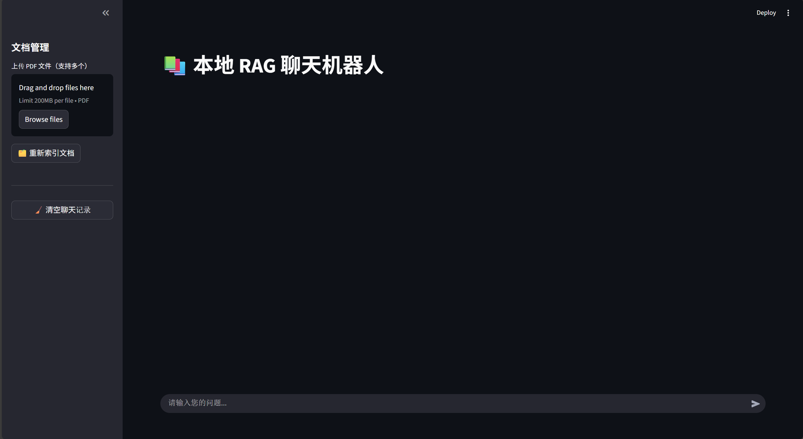

# 📚 Local Chinese PDF RAG Chatbot (Streamlit + Chroma + Ollama)

A local PDF Q&A app that lets you:
- 📄 Upload one or more PDFs  
- 🧠 Build a local vector index (Chroma)  
- 💬 Ask questions with Retrieval-Augmented Generation (RAG)  
- 🔎 View retrieved source snippets + page numbers  

---

## ✨ Features

- 📎 Multiple PDF upload
- 🧱 One-click re-index
- 🧹 Chat history + “clear chat”
- 🧬 Local embeddings (Sentence-Transformers style)
- 🤖 Local LLM via Ollama

---

## 📸 Screenshot



---

## 🗂️ Project structure

✅ Recommended repo contents (commit these):
- `rag_web.py`
- `requirements.txt`
- `README.md`
- `.gitignore`

🚫 Local/runtime contents (do **not** commit):
- `bge-large-zh-v1.5/` (embedding model files)
- `chroma_db_1/` (local vector DB)
- `uploaded_pdfs/` (your PDFs)

---

## ✅ Requirements

🐍 Python 3.10+ (3.11 recommended)

🧰 Ollama installed and running

📦 An Ollama model pulled locally (default in code: `deepseek-r1:14b`)

🧠 A local embedding model folder at `./bge-large-zh-v1.5`

---

## ⚙️ Setup

### 1) 🧪 Create and activate a virtual environment
   
Windows (PowerShell)
```bash
python -m venv .venv
.\.venv\Scripts\Activate.ps1
```

macOS / Linux
```bash
python3 -m venv .venv
source .venv/bin/activate
```

### 2) 📥 Install Python dependencies
   
```bash
pip install -r requirements.txt
```

### 3) 🧠 Prepare the embedding model folder (`bge-large-zh-v1.5/`)

Place your embedding model files under:
```
./bge-large-zh-v1.5/
```

Two common ways:

✅ Option A: use a pre-downloaded folder

Copy the model directory into the project root and rename it to `bge-large-zh-v1.5`.

⬇️ Option B: download via `huggingface_hub` (example snippet)

```Python
from huggingface_hub import snapshot_download

snapshot_download(
    repo_id="sentence-transformers/bge-large-zh-v1.5",
    local_dir="./bge-large-zh-v1.5",
    local_dir_use_symlinks=False,
)
print("Done")
```

### 4) 🤖 Setup Ollama and pull an LLM

Make sure Ollama is running, then pull the model used in `rag_web.py`:

```bash
ollama pull deepseek-r1:14b
```

You can switch to another model by editing in `rag_web.py`:

```bash
OLLAMA_MODEL = "deepseek-r1:14b"
```

---

## ▶️ Run

```bash
streamlit run rag_web.py
```

Open the local Streamlit URL shown in the terminal. 🌐

---

## 🧭 How to use

### 1) In the left sidebar:

  - 📄 Upload one or more PDFs

  - 🗂️ Click “🗂️ 重新索引文档” to build the index

### 2) 💬 Start chatting in the main panel

### 3) 📑 Expand “📑 查看引用来源” to see retrieved sources and page numbers


## 🛠️ Configuration (inside rag_web.py)

```python
🔧 Key settings you may want to adjust:
```

### 🧠 Embeddings model path:

```python
EMBED_MODEL_PATH = "./bge-large-zh-v1.5"
```

### 🗃️ Chroma persistence:

```python
CHROMA_DIR = "./chroma_db_1"
COLLECTION_NAME = "rag_collection"
```

### ✂️ Chunking / retrieval:

```python
CHUNK_SIZE = 600
CHUNK_OVERLAP = 100
TOP_K = 5
```

### 🎚️ Optional similarity score threshold:

```python
USE_SCORE_THRESHOLD = False
SCORE_THRESHOLD = 0.65
```

---

## 🧯 Troubleshooting

### ❗ “Please upload PDF and reindex” keeps showing

  - ✅ Ensure you clicked “重新索引文档” at least once

  - ✅ Or ensure ./chroma_db_1/ already exists and is not empty

### ❗ Ollama errors / model not found

  - ✅ Confirm Ollama is running

  - ✅ Confirm the model exists locally:

  ```bash
  ollama list
  ```

### ❗ Windows: folder/lock issues during reindex

The app deletes and recreates the collection (not the whole folder) to reduce file-lock issues. If you still see locks:

  - 🔒 Close other programs reading chroma_db_1/

  - 🔁 Restart the Streamlit app

### ❗ Answers ignore the PDF content

  - 🔎 Increase TOP_K

  - ✂️ Reduce CHUNK_SIZE if passages are long

  - 🎚️ Turn on USE_SCORE_THRESHOLD only after confirming retrieval works well

---

## 🪪 License

This project is released under the MIT License. See LICENSE for details.


